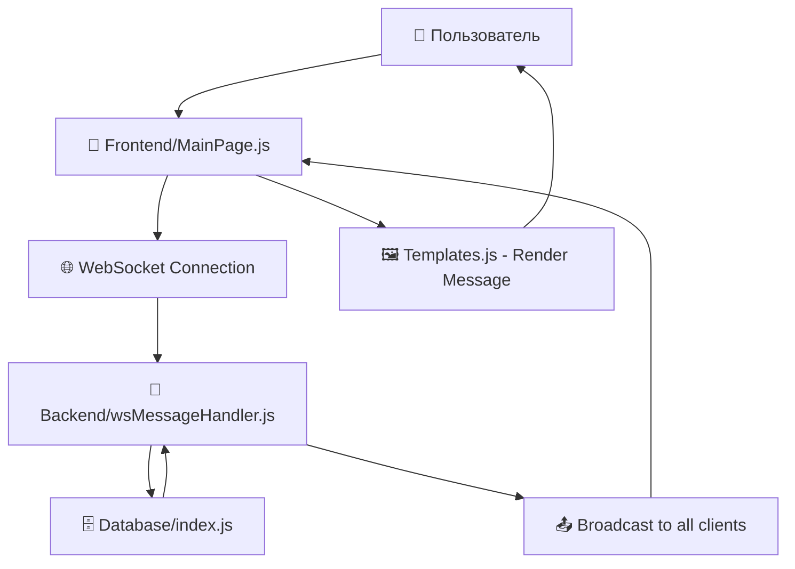
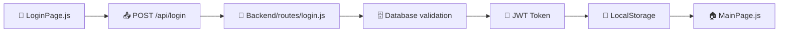
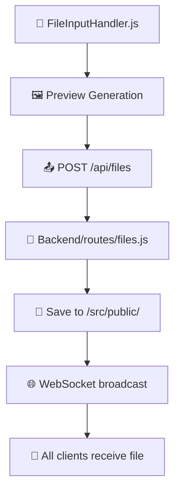

# 📁 Структура проекта Chaos Organizer

## 🌟 Общая архитектура проекта

```
Chaos-Organizer(diploma)/
├── 🔧 backend/              # Серверная часть (Node.js)
├── 🎨 frontend/             # Клиентская часть (Vanilla JS + Vite)
├── 📄 .gitignore           # Общие исключения Git
├── 🔒 bun.lock            # Блокировка зависимостей Bun
└── 📦 package.json        # Общие зависимости проекта
```

---

## 🔧 Backend (Серверная часть)

### 📋 Основная структура

```
backend/
├── 🌐 public/                    # Статические файлы для продакшена
│   └── index.html               # Главная страница (если нужна)
├── 📁 src/                      # Исходный код сервера
│   ├── 🗄️ db/                   # База данных и модели
│   │   └── index.js            # Инициализация и схемы БД
│   ├── 🛠️ helpers/              # Вспомогательные функции
│   │   └── wsMessageHandler.js # Обработчик WebSocket сообщений
│   ├── 📂 public/               # Загружаемые пользователями файлы
│   │   ├── .gitkeep            # Сохранение пустой папки в Git
│   │   ├── *.mp3              # Аудиофайлы пользователей
│   │   ├── *.jpg/*.png        # Изображения пользователей
│   │   ├── *.mp4              # Видеофайлы пользователей
│   │   └── avatar.png         # Аватары по умолчанию
│   ├── 🛣️ routes/               # API маршруты
│   │   ├── attachments.js     # Работа с вложениями
│   │   ├── decryptions.js     # Шифрование/дешифрование
│   │   ├── emoji.js           # API эмодзи
│   │   ├── files.js           # Загрузка файлов
│   │   ├── index.js           # Главный роутер
│   │   ├── login.js           # Авторизация
│   │   ├── phrase.js          # Обработка фраз/команд
│   │   ├── ping.js            # Проверка соединения
│   │   ├── register.js        # Регистрация пользователей
│   │   └── validate_mes.js    # Валидация сообщений
│   ├── 🚀 index.js              # Точка входа приложения
│   └── 🌐 server.js             # Настройка Express и WebSocket сервера
├── 📤 uploads/                   # Временные загрузки (обработка файлов)
├── ⚙️ .editorconfig            # Настройки редактора
├── 🔐 .env                     # Переменные окружения (секреты)
├── 📝 .eslintrc.json          # Настройки линтера ESLint
├── 🚫 .gitignore              # Исключения Git для backend
├── 🎨 .prettierignore         # Исключения форматтера
├── 💄 .prettierrc             # Настройки форматтера Prettier
├── 🔧 jsconfig.json           # Настройки JavaScript проекта
├── 🔄 nodemon.json            # Настройки автоперезапуска
└── 📦 package.json            # Зависимости и скрипты backend
```

### 🎯 Ключевые компоненты Backend

#### 🗄️ База данных (`/src/db/`)
- **`index.js`** - Инициализация SQLite, создание таблиц, CRUD операции

#### 🛣️ API Маршруты (`/src/routes/`)
- **`login.js`** - `POST /api/login` - авторизация пользователей
- **`register.js`** - `POST /api/register` - регистрация новых пользователей  
- **`files.js`** - `POST /api/files` - загрузка файлов (изображения, аудио, видео)
- **`attachments.js`** - `GET /api/attachments` - получение вложений чата
- **`emoji.js`** - `GET /api/emoji` - список доступных эмодзи
- **`decryptions.js`** - `POST /api/decrypt` - дешифрование сообщений
- **`phrase.js`** - обработка команд бота (@chaos: погода, факт, курсы)
- **`ping.js`** - `GET /api/ping` - проверка работоспособности API
- **`validate_mes.js`** - валидация входящих сообщений

#### 🌐 WebSocket (`/src/helpers/`)
- **`wsMessageHandler.js`** - обработка real-time сообщений, трансляция между клиентами

#### 📂 Файловая система
- **`/src/public/`** - постоянное хранение загруженных пользователями файлов
- **`/uploads/`** - временная папка для обработки загрузок

---

## 🎨 Frontend (Клиентская часть)

### 📋 Основная структура

```
frontend/
├── 🌐 public/                   # Статические ресурсы
│   ├── badge-128x128.png       # PWA иконка 128x128
│   ├── chat-256x256.png        # PWA иконка 256x256  
│   ├── chat.png                # Основная иконка
│   ├── manifest.json           # PWA манифест
│   ├── sw.js
│   ├── browserconfig.xml
│   └── robots.txt              # Настройки для поисковиков
├── 📁 src/                     # Исходный код клиента
│   ├── 🎨 assets/              # Ресурсы приложения
│   │   ├── fonts/             # Шрифты
│   │   ├── icons/             # Иконки
│   │   ├── images/            # Изображения
│   │   └── sounds/            # Звуковые эффекты
│   ├── 🖼️ images/              # Дополнительные изображения
│   ├── 💻 js/                  # JavaScript модули
│   │   ├── utils/             # Утилиты
│   │   │   ├── utils.js       # Вспомогательные функции
│   │   │   ├── validation.js
│   │   │   ├── formatting.js
│   │   │   ├── storage.js
│   │   │   └── constants.js
│   │   ├── app.js             # Главный контроллер приложения
│   │   ├── BotRequests.js     # Обработка команд бота
│   │   ├── EmojiHandler.js    # Управление эмодзи
│   │   ├── Encryption.js      # Шифрование сообщений
│   │   ├── FileInputHandler.js # Обработка загрузки файлов
│   │   ├── Geolocation.js     # Работа с геолокацией
│   │   ├── LoginPage.js       # Страница авторизации
│   │   ├── MainPage.js        # Основной интерфейс чата
│   │   ├── MediaHandler.js    # Обработка медиафайлов
│   │   ├── RegisterPage.js    # Страница регистрации
│   │   ├── Sidebar.js         # Боковая панель (поиск, инфо)
│   │   ├── Templates.js       # Генерация HTML шаблонов
│   │   └── Timer.js           # Таймеры и временные функции
│   ├── 🎨 styles/              # SCSS стили
│   │   ├── chats.scss         # Стили списка чатов
│   │   ├── fonts.scss         # Подключение шрифтов
│   │   ├── login_page.scss    # Стили страницы входа
│   │   ├── main.scss          # Главные стили
│   │   ├── messages.scss      # Стили сообщений
│   │   ├── mixins.scss        # SCSS миксины
│   │   ├── null.scss          # Сброс стилей
│   │   ├── popup.scss         # Стили всплывающих окон
│   │   ├── register_page.scss # Стили страницы регистрации
│   │   ├── sidebar.scss       # Стили боковой панели
│   │   └── vars.scss          # SCSS переменные
│   ├── 📄 index.html          # Главный HTML файл
│   ├── 🚀 index.js            # Точка входа приложения
│   └── 📄 old.html            # Старая версия (резерв)
├── 🔧 Конфигурационные файлы
│   ├── .babelrc               # Настройки Babel
│   ├── .browserslistrc        # Поддерживаемые браузеры
│   ├── .editorconfig          # Настройки редактора
│   ├── .env                   # Переменные окружения
│   ├── .eslintrc.json         # Настройки ESLint
│   ├── .gitignore             # Исключения Git
│   ├── .prettierignore        # Исключения Prettier
│   ├── .prettierrc            # Настройки Prettier
│   ├── appveyor.yml           # CI/CD конфигурация
│   ├── postcss.config.js      # Настройки PostCSS
│   ├── tsconfig.json          # Настройки TypeScript
│   └── vite.config.ts         # Настройки Vite
├── 📦 package.json            # Зависимости и скрипты
└── 🤖 .husky/                 # Git хуки для качества кода
```

### 🎯 Ключевые компоненты Frontend

#### 💻 JavaScript Модули (`/src/js/`)

**🏗️ Архитектурные модули:**
- **`app.js`** - главный контроллер, инициализация, роутинг страниц
- **`Templates.js`** - генерация HTML элементов и компонентов

**📱 Страницы приложения:**
- **`LoginPage.js`** - логика авторизации, валидация форм
- **`RegisterPage.js`** - регистрация, загрузка аватара, валидация
- **`MainPage.js`** - основной чат, WebSocket, отправка сообщений

**🛠️ Функциональные модули:**
- **`MediaHandler.js`** - запись аудио/видео, обработка медиафайлов
- **`FileInputHandler.js`** - drag&drop, превью файлов, валидация
- **`EmojiHandler.js`** - панель эмодзи, вставка в сообщения
- **`Encryption.js`** - шифрование/дешифрование сообщений
- **`Geolocation.js`** - определение местоположения пользователя
- **`BotRequests.js`** - обработка команд (@chaos: погода, факт, курсы)
- **`Sidebar.js`** - поиск сообщений, информация о чате
- **`Timer.js`** - таймеры записи, форматирование времени

#### 🎨 Стили (`/src/styles/`)

**📐 Базовые стили:**
- **`null.scss`** - сброс браузерных стилей
- **`vars.scss`** - CSS переменные (цвета, размеры, тайминги)
- **`mixins.scss`** - SCSS миксины для повторного использования
- **`fonts.scss`** - подключение веб-шрифтов

**🖼️ Компонентные стили:**
- **`main.scss`** - общие стили приложения
- **`login_page.scss`** - стили страницы авторизации  
- **`register_page.scss`** - стили страницы регистрации
- **`chats.scss`** - стили списка чатов и пользователей
- **`messages.scss`** - стили сообщений и ввода текста
- **`sidebar.scss`** - стили боковых панелей
- **`popup.scss`** - стили модальных окон и уведомлений

---

## 🔄 Взаимодействие компонентов

### 📡 Поток данных



### 🔐 Аутентификация



### 📁 Загрузка файлов



---

## 🚀 Команды разработки

### Backend
```bash
cd backend
npm install          # Установка зависимостей
npm run dev          # Запуск с автоперезагрузкой (nodemon)
npm start            # Запуск продакшен сервера
npm run lint         # Проверка кода ESLint
npm run format       # Форматирование Prettier
```

### Frontend  
```bash
cd frontend
npm install          # Установка зависимостей
npm run dev          # Запуск dev сервера (Vite)
npm run build        # Сборка для продакшена
npm run preview      # Предварительный просмотр сборки
npm run lint         # Проверка кода ESLint
npm run format       # Форматирование Prettier
```

---

## 🌐 API Endpoints

### 🔐 Аутентификация
- `POST /api/register` - регистрация нового пользователя
- `POST /api/login` - авторизация пользователя

### 💬 Сообщения  
- `WebSocket /` - real-time обмен сообщениями
- `POST /api/validate_mes` - валидация сообщений
- `POST /api/decrypt` - дешифрование сообщений

### 📎 Файлы и медиа
- `POST /api/files` - загрузка файлов
- `GET /api/attachments` - получение вложений чата

### 🎭 Дополнительные функции
- `GET /api/emoji` - список эмодзи
- `POST /api/phrase` - обработка команд бота
- `GET /api/ping` - проверка работоспособности

---

## 🔧 Технологический стек

### Backend
- **Node.js** - серверная платформа
- **Express.js** - веб-фреймворк  
- **WebSocket (ws)** - real-time коммуникация
- **SQLite** - встроенная БД
- **Multer** - загрузка файлов
- **bcrypt** - хеширование паролей
- **jsonwebtoken** - JWT токены
- **crypto-js** - шифрование данных

### Frontend
- **Vanilla JavaScript (ES6+)** - без фреймворков
- **Vite** - сборщик и dev сервер
- **SCSS** - препроцессор CSS
- **WebSocket API** - real-time соединение
- **MediaDevices API** - запись аудио/видео
- **Geolocation API** - определение местоположения
- **PWA** - прогрессивное веб-приложение

---

## 📱 Функциональность

### ✨ Основные возможности
- 💬 Real-time чат с WebSocket
- 🔐 Регистрация и авторизация пользователей
- 📎 Загрузка файлов (изображения, аудио, видео)
- 🎤 Запись голосовых сообщений  
- 📹 Запись видеосообщений
- 😀 Панель эмодзи
- 🔒 Шифрование сообщений
- 🗺️ Отправка геолокации
- 🔍 Поиск по сообщениям
- 📊 Статистика вложений чата

### 🤖 Бот-команды
- `@chaos: погода` - запрос погоды
- `@chaos: курсы валют` - актуальные курсы валют  
- `@chaos: факт` - интересный исторический факт

### 📱 PWA возможности
- 📲 Установка как нативное приложение
- 🔄 Офлайн кэширование (Service Worker)
- 📳 Push уведомления
- 🎯 Адаптивный дизайн

---

## 🔒 Безопасность

- 🔐 JWT токены для аутентификации
- 🧂 Bcrypt хеширование паролей  
- 🔒 AES шифрование сообщений
- 🛡️ Валидация всех входящих данных
- 🚫 Защита от XSS и SQL инъекций
- 📁 Безопасная загрузка файлов
- 🌐 CORS настройки